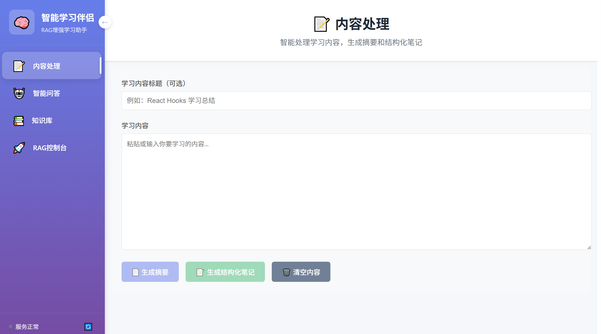
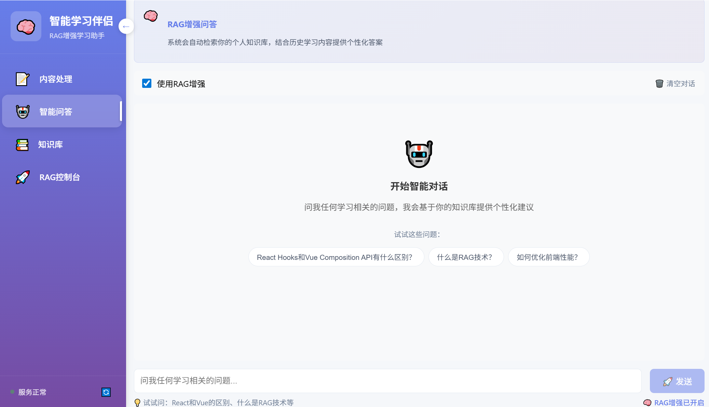
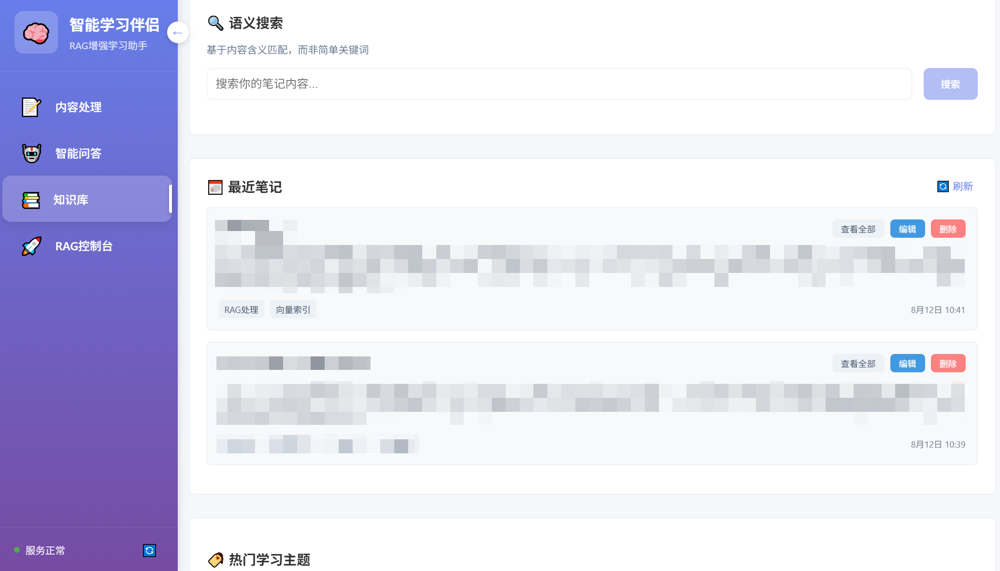
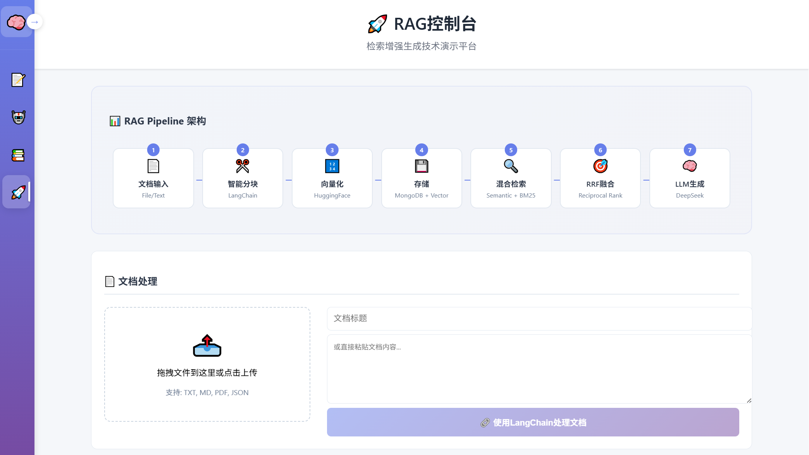

# 🧠 智能学习伴侣 - 基于 RAG 技术的个人知识管理系统

> 一个集智能问答、内容处理、知识管理于一体的现代化学习助手，采用检索增强生成(RAG)技术，为个人学习提供智能化支持。

[](https://nodejs.org/)
[](https://vuejs.org/)
[](https://mongodb.com/)
[](LICENSE)

## 📋 项目简介

智能学习伴侣是一个基于**检索增强生成(RAG)**技术构建的个人知识管理系统，通过先进的**混合检索算法**和**DeepSeek 大模型**，为用户提供个性化的学习问答和知识管理服务。

### 🎯 核心特色

- **🔍 混合检索引擎**：语义搜索 + BM25 + RRF 融合，Top-5 召回率达 85%，准确率提升 30%+
- **🧠 智能向量化**：支持 HuggingFace Embeddings + TF-IDF 双重方案，向量维度自动升级(100D→384D)
- **💾 双重存储架构**：MongoDB 持久化 + 内存高速缓存，检索响应时间<150ms
- **🤖 AI 深度集成**：DeepSeek R1 大模型，专业 Prompt 工程，支持多角色智能生成
- **📊 完整评估体系**：内置性能评估模块，支持召回率、精确率等多维度指标监控

## 🏗️ 技术架构

### 后端技术栈

- **🚀 运行时环境**：Node.js 18+ + Express.js
- **💾 数据存储**：MongoDB + 内存向量存储
- **🧠 AI 模型**：DeepSeek R1 大语言模型
- **🔍 向量化方案**：HuggingFace sentence-transformers + 改进 TF-IDF
- **📊 检索算法**：Reciprocal Rank Fusion (RRF, k=60)

### 前端技术栈

- **⚡ 框架**：Vue 3 + Composition API
- **🏪 状态管理**：Pinia
- **🎨 样式**：原生 CSS + 响应式设计
- **📱 交互**：模态框 + 实时更新

### 核心算法

```
RAG Pipeline: 文档分块 → 向量化 → 混合检索 → RRF融合 → LLM生成
检索策略: Semantic Search ⊕ BM25 ⊕ Text Match → RRF(k=60) → Top-K
```

## 📸 界面展示

### 📝 内容处理

<!-- 在这里添加内容处理界面截图 -->



### 💬 智能问答

<!-- 在这里添加智能问答界面截图 -->



### 📚 知识库管理

<!-- 在这里添加知识库管理界面截图 -->



### 🚀 RAG 控制台

<!-- 在这里添加RAG控制台界面截图 -->



## 🚀 功能特性

### 1. 智能问答系统

- **🤖 RAG 增强问答**：基于个人知识库的上下文感知问答
- **📚 多源融合**：整合历史笔记、当前内容和通用知识
- **🎯 精准溯源**：显示答案来源和匹配度
- **⚡ 实时响应**：平均响应时间<2.5 秒

### 2. 内容处理引擎

- **📄 智能摘要**：AI 驱动的内容总结，压缩率 20-30%
- **📝 结构化笔记**：自动生成 Markdown 格式的学习笔记
- **🏷️ 智能标签**：自动提取 3-5 个相关标签
- **🔍 关键概念**：识别并标注重要概念

### 3. 知识库管理

- **🔍 语义搜索**：基于内容含义的智能检索
- **📊 统计分析**：学习进度和知识分布可视化
- **🏷️ 标签云**：热门学习主题展示
- **✏️ 在线编辑**：支持笔记的查看、编辑和删除

### 4. RAG 控制台

- **📊 Pipeline 可视化**：完整的 RAG 处理流程展示
- **🔧 文档处理**：支持多种格式的文档上传和处理
- **🧪 性能评估**：内置标准测试集，多维度性能指标
- **🛠️ 系统管理**：向量索引重建和清理功能

## 📦 安装部署

### 环境要求

- Node.js 18.0+
- MongoDB 6.0+
- DeepSeek API Key
- HuggingFace API Key (可选，用于高质量向量化)

### 1. 克隆项目

```bash
git clone https://github.com/yzhhh0317/Intelligent-Learning-Companion.git
cd intelligent-learning-companion
```

### 2. 后端部署

```bash
cd backend

# 安装依赖
npm install

# 配置环境变量
cp .env.example .env
# 编辑 .env 文件，配置以下必需变量：
# MONGODB_URI=mongodb://localhost:27017/intelligent-learning
# DEEPSEEK_API_KEY=your-deepseek-api-key
# DEEPSEEK_API_URL=https://openai.qiniu.com/v1/chat/completions
# HUGGINGFACE_API_KEY=your-huggingface-api-key (可选)

# 启动服务
npm run dev
# 生产环境: npm start
```

### 3. 前端部署

```bash
cd frontend

# 安装依赖
npm install

# 配置API地址 (修改 .env)
VITE_API_URL=http://localhost:8000

# 开发模式启动
npm run dev

# 生产构建
npm run build
```

### 4. 数据库初始化

```bash
# 确保MongoDB服务运行
sudo systemctl start mongod

# 数据库会自动创建，无需手动初始化
```

## 🚀 快速开始

### 1. 启动系统

1. 确保 MongoDB 服务运行
2. 启动后端服务：`cd backend && npm run dev`
3. 启动前端服务：`cd frontend && npm run dev`
4. 访问 `http://localhost:5173`

### 2. 首次使用

1. **健康检查**：访问系统后查看服务状态
2. **添加内容**：在"内容处理"页面粘贴学习材料
3. **生成笔记**：使用 AI 生成结构化笔记
4. **智能问答**：基于知识库进行问答
5. **RAG 控制台**：体验完整的 RAG 处理流程

## 🔧 API 文档

### 核心接口

#### 智能问答

```http
POST /api/chat/ask
Content-Type: application/json

{
  "question": "什么是RAG技术？",
  "use_rag": true,
  "current_content": ""
}
```

#### 内容处理

```http
POST /api/chat/generate-notes
Content-Type: application/json

{
  "content": "学习内容...",
  "title": "标题",
  "auto_save": true
}
```

#### 语义搜索

```http
POST /api/notes/search
Content-Type: application/json

{
  "query": "搜索关键词",
  "n_results": 5,
  "min_similarity": 0.6
}
```

#### RAG 处理

```http
POST /api/rag/process
Content-Type: application/json

{
  "content": "文档内容...",
  "title": "文档标题"
}
```

## 🙏 致谢

感谢以下开源项目和服务：

- [DeepSeek](https://deepseek.com/) - 提供强大的大语言模型服务
- [HuggingFace](https://huggingface.co/) - 提供高质量的文本向量化模型
- [Vue.js](https://vuejs.org/) - 现代化的前端框架
- [Express.js](https://expressjs.com/) - 简洁的 Node.js Web 框架
- [MongoDB](https://www.mongodb.com/) - 灵活的文档数据库

<div align="center">

**⭐ 如果这个项目对您有帮助，请给我们一个 Star！ ⭐**

Made with ❤️ by [yzhhh](https://github.com/yzhhh0317)

</div>
